<!-- Code from commit TODO -->
# **Animalopoly**

## <u>**Overview**</u>

A Monopoly-style board game themed around running a zoo, with 4 players, where the players roll dice to move around the board and purchase animals.

## <u>**Analysis**</u>

### Background

Monopoly is a board game wherein players attempt to be the last player left who is not bankrupt. They do this by purchasing and upgrading properties, as players must pay the owner a fee when they land on an owned property. They move around a board by rolling two dice, and are offered the choice of purchasing an unowned property if they land on it; if they own all of the properties in a set already, they may build houses or hotels on the property.

Animalopoly will be quite similar, although it is themed around running a zoo and purchasing animals rather that about being a land owner and purchasing properties.

### End users

Unlike the original Monopoly, Animalopoly will be aimed at families with young children; as such, the theming must be changed, as young children will likely be bored by the original theme; I chose to make it be about running a zoo and owning animals. Similarly, some of the more complex and hence potentially confusing systems will be changed or removed, for example mortgaging properties and the system of houses and hotels.

### Alternative solutions

#### Monopoly

Monopoly is the most obvious alternative solution, however it has various flaws; I spoke with several people who had played the original and asked their opinions on it. They felt that the core concept and gameplay loop had potential, but they had several critiques:

- The theme of Monopoly is dull and uninteresting
- Games often last a long time, and it is difficult to stop playing in the middle of a game, as the board cannot be put away or easily moved mid-game
- The board is large & thus difficult to carry around, and set-up takes a long time
- There are no good computer-based versions of Monopoly
- Those that do exist are often very resource-intensive, which makes them difficult to run on low-end devices
- Being sent to Jail is annoying, particularly when you are trying to reach a specific property
- Being forced to put a property up for auction if they choose not to buy it when they land on it is less fun, as it means every property is owned very quickly

I will take this criticism into account when designing Animalopoly:

- I will change the theme, as previously mentioned
- I will have the ability to save and load games, allowing them to be paused
- Being an computer game makes it easy to carry and means there is no setup time
- I will implement a Command Line Interface (CLI)-based UI, which will use very little resources, allowing it to run on low-performance devices
- I will remove Jail and replace the 'Go to Jail' square with a 'Miss A Go' square
- When a player chooses not to buy a property, there will not be an auction; instead, the next player to land on it will be offered the choice of buying it, as if the first had never landed there

I will also change other aspects to make the game simpler for the young children:

- As previously mentioned, mortgaging properties (where the property remains owned but cannot collect rent) will be removed and the intricacies of upgrades (the difference between hotels and houses, requiring all properties in a set to construct anything, and only being able to upgrade the least developed property in a set) will be changed to simply levelling up the animal for the same price as it cost to buy it
- Furthermore, unlike the original where you can upgrade a property as many times as you can afford (and are allowed to under the rules), you will only be able to upgrade a property once each time it is landed on
- Upgrades will not be reset on trading properties
- I will remove railroads and utilities
- I will reduce the size of the board

#### [Intrepidcoder's web-based Monopoly](https://github.com/intrepidcoder/monopoly)

This is a version of Monopoly written in Javascript and HTML, and as such is playable in browser. It is a near one-to-one recreation of the original game, and as such the problems with it still apply. Furthermore, it introduces some new problems:

- The UI is very colourless, being almost entirely in black and white; in my version, I will use colours to signify important information, as well as to make the game more visually appealing
- The order of players in randomised, whereas in the original this is up to the players; in my version, the player order will be determined by the order players enter their names, and hence is up to them
- There is no way to tell which set a property is in; in Animalopoly, I will show this clearly
- There is no way to see how much it costs to land on a property; I will show this clearly

They also have some features which I feel are improvements on the original:

- Being browser-based, it is very accessible to play
- Each player is represented by a colour; I will do the same in mine
- Players can be controlled by AI; I will attempt to do the same, building on it by adding different levels of AI
- The dice being rolled are visible on-screen; I will show them in the UI in mine
- There is the ability to view the properties a player owns; I will implement this in mine

#### [Zhongyi-tong's web-based Monopoly](https://github.com/zhongyi-tong/monopoly)

This is a browser-based 3D version of Monopoly with the ability to play games with people on other clients. Similarly to Animalopoly, the theming has been changed; the properties are now all named after locations around Carnegie Mellon University. This version adds new imporovements onto the original Monopoly:

- The game ends after the first person runs out of money, whereas in the original it ends when there is only one person left, which tackles the problem of games taking a long time
- It is possible to play with other people remotely, and there is a built-in chat to communicate with them
- The board is 3D and looks more appealing than they original game
- There is an in-game tutorial explaining how to play the game

### Prototype versions

The first version of Animalopoly I made was very basic; the animals had no names and no sets, and everything was one colour. I showed this prototype to some potential users and got the following feedback, which I implemented

- The animals should have sets and be named based on the set; I chose to base them first off of how common they are in the UK (split into Common, Rare, and Wild), then off of [IUCN Red List Categories](https://www.iucnredlist.org/), and then a final set Fictional. I did this in order to raise awareness of the importance of conserving these animals to the young children.
- The players should be coloured to distinguish between them more easily, and the animals should be coloured to match their owners
- There should be pauses between each important event being shown to give players time to read it
- Having a way to see how well you had been doing throughout the game could be useful; I did this by adding graphs of how much money each player had throughout the game

Having implemented these, I showed the new version to other potential users and their primary suggestion was to add a Graphical User Interface (GUI) as an alternative to the current CLI-based UI, to allow greater flexibility in the UI and to keep user input and information separate from the board; I implemented this and gave the player the choice to enable it at the start of the game.

The GUI version also had the following feedback which I implemented:

- Having dice visibly roll on the GUI board
- Having pieces move one space at a tim on the GUI board
- Having the current stop cost highlighted when landing on an animal
- Having the set multiplier shown on the animal card

### Objectives

#### Starting:

1. Players should be allowed to enter any one-char name. If their name is invalid, they should be prompted to enter a new name

#### UI:

2. Players' names should be shown
3. The board should be shown
4. It should be possible to distinguish between players with the same name
5. The name, set, and owner of an animal should be apparant at a glance
6. There should be a UI element for an animal showing at least the following information: the animal's name, the animal's level, how much a player has to pay if they land there, how much the animal costs to buy/upgrade, the set the animal is in, and the animal's owner
7. There should be an option to use a CLI-based UI
8. There should be an option to use a GUI which exists in a separate window, with the console being used only for text output and input
9. The rolling dice should be visible, as should their final result and the number of spaces the player should move
10. Text should be easily readable, with sufficient contrast against the background
11. Text should allow formatting to draw attention to certain parts, and to make its purpose clear
12. On the live-refreshing GUI, player pieces should visibly take 'steps' as they move

#### Movement:

13. The number of spaces moved should be pseudorandom with an expected distribution matching that of rolling 2 6-sided dice and adding the faces shown
14. If the dice show the same face, the player should be awarded a random card
15. Upon landing on an unowned space, players should be given the choice whether or not to buy, with the UI element showing the animal's information being displayed
16. Upon landing on a space they own, players should be given the choice whether or not to upgrade, with the animal info UI element shown
17. Upon landing on a space owned by another player, players should be informed they have to pay the owner, with the animal info UI element shown
18. Upon passing start, players should be awarded £500
19. Upon landing on start, players should be awarded £1000 and not awarded the £500 for passing it
20. Upon landing on the 'Miss A Go' square, players should be informed their next turn will be skipped; this should also be clear when it gets to their skipped turn

#### Commands:

Throughout the game, players should be able to run 'commands' to take actions or view information that should not always be taken/shown, e.g. saving the game and viewing a player's money

21. Players should be able to run commands to take certain actions
22. There should be a command to see an explanation of what commands exist, and how to use them
23. There should be the ability to save and load on demand via a command
24. There should be a command to alter a player's money, both for testing and to allow players to customise their game experience; this should be considered a 'cheat', and confirmation should be required before the first cheat can be run
25. There should be the ability to view information about players on demand
26. There should be the ability to view the card for an animal on demand
27. There should be the ability for players to trade animals and/or money on demand

#### AI:

To allow the game to be played with less than 4 players, there should be the ability to have AI/CPU players

28. There should be the option to have AI 'players', so that the game can be played with fewer than 4 players
29. There should be varying strengths of AI available
30. One AI - the 'easy' AI - should always buy/upgrade the animals, when it is given the opportunity
31. One AI - the 'medium' AI - should always buy/upgrade the animals if doing so would not put it at risk of bankruptcy before its next turn
32. One AI - the 'hard' AI - should only buy/upgrade an animal if it has determined it is a good investment and that doing so would not put it at risk of bankruptcy before its next turn
33. One AI - the 'expert' AI - should predict the possible future states of the game and [maximise the worst-case probability of it winning](https://en.wikipedia.org/wiki/Minimax)

#### Saving:

34. There should be the ability to save and load
35. Saving should write every important piece of data to disk, such that the program can be completely relaunched and the save file can be loaded to resume the game with no noticable differences
36. There should be data cleaning to prevent invalid names - e.g. ones containing slashes - from being used

#### Ending:

37. When players go 'into debt' (have negative money), they should be informed and have one turn to get out of debt or else be eliminated
38. When players are eliminated, their animals should have their owner cleared, but should not return to the base level, thus making them more valuable
39. When there is only one player left in, the game should end and they should be declared the winner. If all remaining players are eliminated on the same turn, the winner should be decided by which player had the smallest 'debts' (had the least negative money)
40. After the game ends, a 'game review' graph should be generated to let players see how much many they had throughout the game

#### Graph:

41. The graph should show how much money each player had on each turn
42. The players should be easily distinguishable on the graph
43. There should be a command to generate a graph at any time at any resolution
44. The text in the graph should be readable regardless of the resolution
45. The markings for the axes should not overlap eachother
46. It should be apparant how much money players start with, and at what point they are in danger of bankruptcy
47. The axes should automatically scale to fit the data

## <u>**Design**</u>

### Interface design:

#### CLI-based UI:

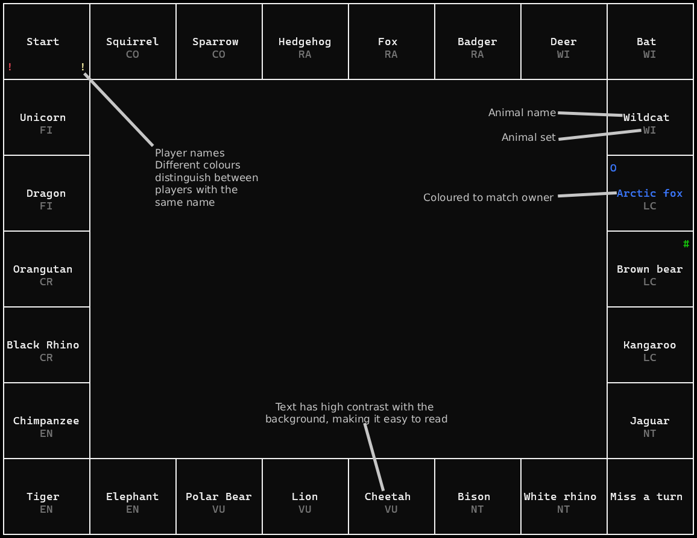

#### GUI:

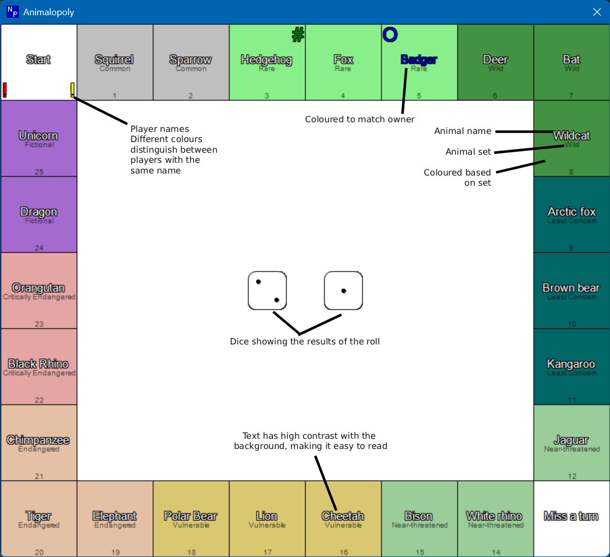

#### Animal info card:

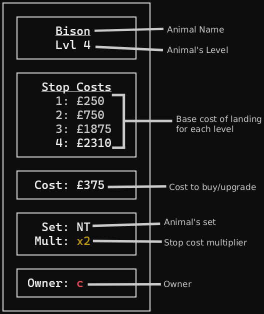

#### Saving:

Save files will be stored as [MessagePack binary files](https://msgpack.org/index.html "MessagePack home page")

They will store every player's data, as well as the name of the current game, the turn count, and whether or not cheats have been enabled.

#### Class Diagram:

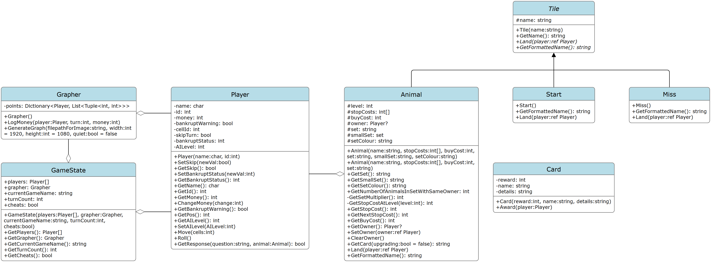

#### Graphs:

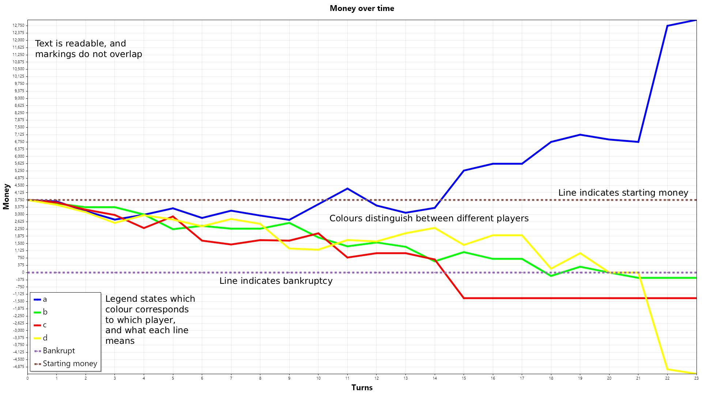
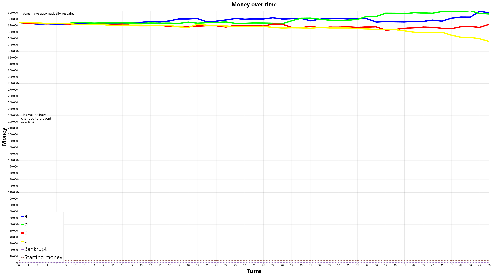
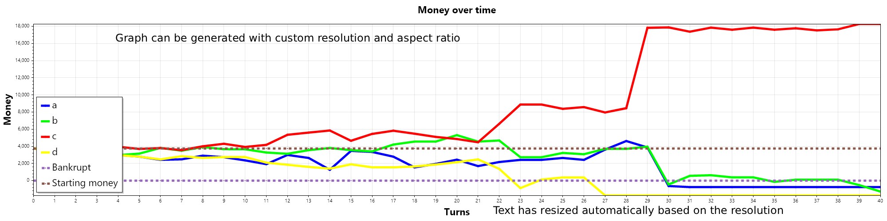

#### Algorithms:

##### The main gameplay loop, used for each non-eliminated player each turn:

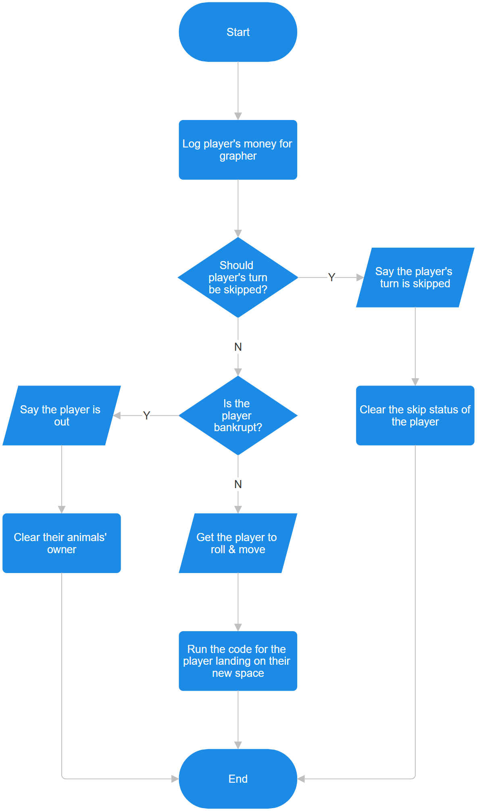

##### The GUI rendering loop, executed every frame for each tile:

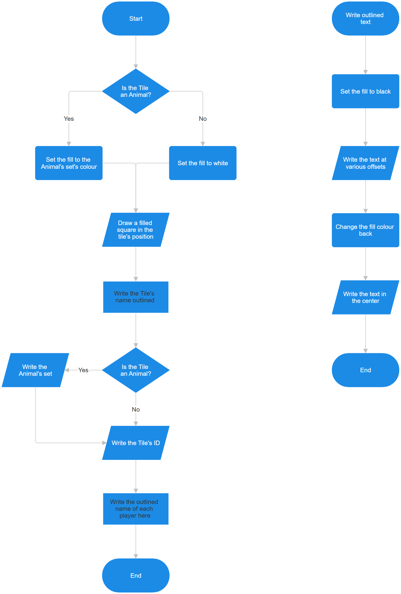

## <u>**Technical Solution**</u>

_Note that some lines of code have been removed for brevity; see the [Appendix](#Appendix) for the unaltered code_

### Text output

As I planned to have coloured text, I needed to determine a method to write coloured text to console; I created a function to do so:

    private static void WriteColour(string string_to_write, ConsoleColor colour)
    { // Writes an entire string in a certain colour and then resets it
        Console.ForegroundColor = colour;
        Console.Write(string_to_write);
        Console.ForegroundColor = ConsoleColor.White;
    }

Originally, I alternated between Console.Write calls and WriteColour calls when I wanted to print a message in multiple colours, however this quickly led to unclear code. As such, I wrote a new function using WriteColour which would allow me to colour text by placing the colour in square brackets beforehand. As part of this, I wanted to implement a colour code '[prev]' which would revert to the most recently-used colour. To allow this to be done several times, I created a stack of colours to keep track, with new colours pushing to the stack and [prev] popping of off the stack:

    public static void Write(string text)
    { // Alternative to Console.Write that supports coloured text being written using colour codes e.g. [blue], [red]
        ConsoleColor colour = ConsoleColor.White;
        Stack<ConsoleColor> prev_colours = new Stack<ConsoleColor>();
        string currentANSIFormatting = "";
        string textCache = "";
        for (int i = 0; i < text.Length; i++)
        {
            char c = text[i];
            if (
                c == '[' 
                && (i < 4 || text[i - 1] != '\u001b')  // Prevent ANSI escape sequences (for underline) from getting treated as colour codes
                )
            {
                // Clear cache
                WriteColour(textCache, colour);
                textCache = "";

                string newColourName = "";
                i++;
                c = text[i];
                while (c != ']')
                {
                    newColourName += c;
                    i++;
                    c = text[i];
                }
                if (colourNameLookup.ContainsKey(newColourName))
                {
                    prev_colours.Push(colour);
                    colour = colourNameLookup[newColourName];
                }
                else if (newColourName == "prev" && prev_colours.Count > 0) // If [prev] is used with no prev to go back to, it's written as-is
                {
                    colour = prev_colours.Pop();
                }
                else // Just regular text in [] e.g. [foo]
                {
                    textCache += $"{currentANSIFormatting}[{newColourName}]";
                }
            }
            else if (c == '\u001b')
            {
                string ANSICode = "\u001b";
                i++;
                c = text[i];
                while (c != 'm')
                {
                    ANSICode += c;
                    i++;
                    c = text[i];
                }
                ANSICode += "m";
                currentANSIFormatting = ANSICode;
            }
            else
            {
                textCache += $"{currentANSIFormatting}{c}";
            }
        }
        WriteColour(textCache, colour);
    }
    public static void WriteLine(string text)
    { // Alternative to WriteLine allowing colour codes
        Write(text);
        Console.WriteLine(); // Using Console.WriteLine rather than appending an Environment.NewLine to make sure no functionality is lost
    }
    public static void WriteLine()
    { // Only exists to completely avoid Console.WriteLine()
        Console.WriteLine();
    }

### Core classes

I then began implementing the Player class documented in the UML diagram, using Write and WriteLine instead of Console.Write and Console.WriteLine:

	public class Player
	{
        private readonly char name;
        private readonly int id;
        private int money;
        private bool bankruptWarning;
        private int cellId;
        private bool skipTurn;
        private int bankruptStatus; // 0: Normal, 1: Turn started since warning, 2: Bankrupt this turn, 3: Bankrupt before this turn
        private int AILevel;
        
	    public Player(char name, int id)
        {
            this.name = name;
            this.id = id;
            money = 3750;
            bankruptWarning = false;
            cellId = 0;
            skipTurn = false;
            AILevel = 0;
        }

        public void ChangeMoney(int change)
        {
            money += change;
            if (money < 0 && !bankruptWarning)
            {
                WriteLine($"[{colourNames[id]}]{name}[white] is in danger of bankruptcy...");
                bankruptWarning = true;
            }
            else if (money > 0 && bankruptWarning)
            {
                WriteLine($"[{colourNames[id]}]{name}[white] is no longer in danger of bankruptcy (They have £{money})");
                bankruptWarning = false;
                this.bankruptStatus = 0;
            }
        }

        public void Move(int cells)
        { // Makes the player move cells spaces along the board; doesn't 'land' on the destination
            if (animations)
            {
                for (int _ = 0; _ < cells; _++) // Animate piece movement
                {
                    cellId++;
                    Thread.Sleep(200);
                }
            }
            else
            {
                cellId += cells;
            }
            if (cellId > 26)
            {
                WriteLine($"[{colourNames[id]}]{name}[white] passed Start and got £500");
                ChangeMoney(500);
            }
            cellId %= 26;
        }

        public void Roll()
        { // Rolls the dice and then moves the resulting amount
            Random rnd = new Random();
            int die1 = rnd.Next(1, 7);
            int die2 = rnd.Next(1, 7);
            if (animations) // Show the dice 'rolling'
            {
                for (int _ = 0; _ < 10; _++)
                {
                    shownDie1 = rnd.Next(1, 7);
                    shownDie2 = rnd.Next(1, 7);
                    if (!guiMode)
                    {
                        Write($"{new string('\b', 5)}{shownDie1} + {shownDie2}");
                    }
                    Thread.Sleep(50);
                }
            }
            if (guiMode)
            {
                shownDie1 = die1;
                shownDie2 = die2;
            }
            WriteLine($"{new string('\b', 5)}{die1} + {die2} = {die1 + die2}");
            if (die1 == die2)
            {
                GetRandomCard(cards).Award(this);
                if (animations)
                {
                    Thread.Sleep(100);
                }
            }
            Move(die1 + die2);
        }
    }

Having done this, I was able to implement the spaces on the board; as the Start and Miss A Go tiles are distinct from animals, while still sharing some properties, so I chose to have them all inherit from an abstract base class 'Tile':

    public abstract class Tile
    {
        protected string name;
        public Tile(string name)
        {
            this.name = name;
        }
        public string GetName()
        {
            return name;
        }
        public abstract void Land(ref Player player); // Events that occur when landing on the tile
        public abstract string GetFormattedName(); // How the name should be printed
    }

I then implemented the special tiles as Start and Miss, both inheriting from Tile:

    public class Start : Tile
    {
        public Start() : base("Start") { }
        public override string GetFormattedName()
        {
            return this.GetName();
        }
        public override void Land(ref Player player)
        {
            WriteLine($"[{colourNames[player.GetId()]}]{player.GetName()}[white] landed on Start and got £1000");
            player.ChangeMoney(1000);
            if (animations)
            {
                Thread.Sleep(100);
            }
        }
    }

    public class Miss : Tile
    {
        public Miss() : base("Miss a turn") { }
        public override string GetFormattedName()
        {
            return this.GetName();
        }
        public override void Land(ref Player player)
        {
            player.SetSkip(true);
            WriteLine("Miss a turn!");
        }
    }

Next, I implemented the Animal class:

    public class Animal : Tile
    {
        protected int level;
        protected int[] stopCosts;
        protected int buyCost;
        protected Player? owner;
        protected string set; // Shown on card & GUI board
        protected string smallSet; // Shown on CLI board, and card if set is too long
        protected string setColour;

        public Animal(string name, int[] stopCosts, int buyCost, string set) : base(name) // Uses default set smallSet and setColour
        {
            this.name = name;
            this.level = 0;
            this.stopCosts = stopCosts;
            this.buyCost = buyCost;
            this.owner = default(Player);
            this.set = set;
            this.smallSet = sets[set].Item1;
            this.setColour = sets[set].Item2;
        }

        private int GetNumberOfAnimalsInSetWithSameOwner()
        {
            if (this.owner is null)
            {
                return 1;
            }
            int animalsInSet = 0;
            foreach (Tile tile in locations)
            {
                if (tile is Animal animal && animal.GetSet() == this.set && animal.GetOwner() == this.owner)
                {
                    animalsInSet++;
                }
            }
            return animalsInSet;
        }

        private int GetSetMultiplier()
        {
            // GetSetMultiplier() == Math.Pow(2, (GetNumberOfAnimalsInSetWithSameOwner() - 1)) currently, but this is hardcoded to make it easier to change
            int numberOfAnimalsInSet = GetNumberOfAnimalsInSetWithSameOwner();
            int result = numberOfAnimalsInSet switch
            {
                1 => 1,
                2 => 2,
                3 => 4,
                _ => throw new Exception($"{numberOfAnimalsInSet} animals in one set"),
            };
            return result;
        }

        private int GetStopCostAtLevel(int level)
        {
            int result = stopCosts[level - 1]; // -1 as level is 1-indexed
            result *= GetSetMultiplier();
            return result;
        }

        public int GetStopCost() // Returns the current Stop Cost or, if level == 0, the next stop cost
        {
            if (level == 0)
            {
                return GetStopCostAtLevel(1);
            }
            else
            {
                return GetStopCostAtLevel(level);
            }
        }

        public string GetCard(bool upgrading = false)
        { // Gets the info card for the animal
            string levelString = $"Lvl {level}";

            int nameSpaceCount = (16 - this.name.Length) / 2;
            int levelSpaceCount = (16 - levelString.Length) / 2;

            string card = "";
            card += $"┌────────────────────┐\n";
            card += $"│ ┌────────────────┐ │\n";
            card += $"│ │{new string(' ', nameSpaceCount)}{Underline(name)}{new string(' ', (int)Math.Floor((16 - this.name.Length) / 2.0 + 0.5))}│ │\n";
            card += $"│ │{new string(' ', levelSpaceCount)}{levelString}{new string(' ', Convert.ToInt32((16 - levelString.Length) / 2.0 + 0.5))}│ │\n";
            card += $"│ └────────────────┘ │\n";
            card += $"│ ┌────────────────┐ │\n";
            card += $"│ │   {Underline("Stop Costs")}   │ │\n";
            for (int i = 0; i < this.stopCosts.Length; i++)
            {
                card += $"│ │     {(i + 1 == level ? "[white]" : (upgrading && (i + 1 == level + 1) ? "[yellow]" : "[grey]"))}{i + 1}: £{this.stopCosts[i]}[prev]{new string(' ', 7 - (Convert.ToString(this.stopCosts[i]).Length))}│ │\n";
            }
            card += $"│ └────────────────┘ │\n";
            card += $"│ ┌────────────────┐ │\n";
            card += $"│ │  Cost: £{this.buyCost}{new string(' ', 7 - Convert.ToString(this.buyCost).Length)}│ │\n";
            card += $"│ └────────────────┘ │\n";
            card += $"│ ┌────────────────┐ │\n";
            if (Convert.ToString(this.set).Length <= 8)
            {
                card += $"│ │   Set: {this.set}{new string(' ', 8 - Convert.ToString(this.set).Length)}│ │\n";
            }
            else
            {
                card += $"│ │   Set: {this.smallSet}{new string(' ', 8 - Convert.ToString(this.smallSet).Length)}│ │\n";
            }
            if (this.GetSetMultiplier() != 1)
            {
                card += $"│ │  Mult: [dark yellow]x{this.GetSetMultiplier()}[prev]      │ │\n";
            }
            card += $"│ └────────────────┘ │\n";
            card += $"│ ┌────────────────┐ │\n";
            if (this.owner != null)
            {
                card += $"│ │ Owner: [{colourNames[this.owner.GetId()]}]{this.owner.GetName()}[white]{new string(' ', 8 - Convert.ToString(this.owner.GetName()).Length)}│ │\n";
            }
            else
            {
                card += $"│ │ Owner: None{new string(' ', 8 - "None".Length)}│ │\n";
            }
            card += $"│ └────────────────┘ │\n";
            card += $"└────────────────────┘";

            return card;
        }

        public override void Land(ref Player player)
        {
            if (this.owner is null)
            {
                WriteLine(this.GetCard(this.level == 0));
                if (player.GetResponse("buy", this))
                {
                    player.ChangeMoney(-1 * this.buyCost);
                    this.owner = player;
                    if (this.level == 0)  // Animals of bankrupted players should stay at their current levels
                    {
                        this.level = 1;
                    }
                }
            }
            else if (this.owner.GetId() == player.GetId())
            {
                if ((this.level + 1) <= this.stopCosts.Length)
                {
                    WriteLine(this.GetCard(true));
                    if (player.GetResponse("upgrade", this))
                    {
                        player.ChangeMoney(-1 * this.buyCost);
                        this.level++;
                    }
                }
                else
                {
                    WriteLine(this.GetCard(false));
                    if (this.owner.GetAILevel() == 0)
                    {
                        WriteLine($"You own this animal. You can't upgrade it any more");
                    }
                }
            }
            else
            {
                WriteLine(this.GetCard(false));
                int animalsInSet = GetNumberOfAnimalsInSetWithSameOwner();
                WriteLine($"[{colourNames[this.owner.GetId()]}]{this.owner.GetName()}[prev] owns this animal. ");
                if (this.owner.GetAILevel() == 0)
                {
                    if (animalsInSet <= 1)
                    {
                        WriteLine($"You have to pay them a fee of £{this.GetStopCost()} (you now have £{player.GetMoney() - this.GetStopCost()})");
                    }
                    else
                    {
                        WriteLine($"They have {animalsInSet} animals from that set, so you have to pay them a fee of £{this.GetStopCost()} (you now have £{player.GetMoney() - this.GetStopCost()})");
                    }
                }
                player.ChangeMoney(-1 * this.GetStopCost());
                this.owner.ChangeMoney(this.GetStopCost());
            }
        }

        public override string GetFormattedName()
        {
            if (this.owner != null)
            {
                return $"[{colourNames[this.owner.GetId()]}]{this.name}[prev]";
            }
            else
            {
                return this.name;
            }
        }

I next had to implement the cards that are awarded when a player rolls the same number twice; I created a Card class as shown in the design, and a function to award a random card:

    public class Card
    {
        private readonly int reward;
        private readonly string name;
        private readonly string details;
        public Card(int reward, string name, string details)
        {
            this.reward = reward;
            this.name = name;
            this.details = details;
        }
        public void Award(Player player)
        { // Award this card to player
            WriteLine(name);
            WriteLine(details);
            player.ChangeMoney(this.reward);
        }
    }

    public static Card GetRandomCard((int, string, string)[] cards)
    {
        Random rnd = new Random();
        int index = rnd.Next(0, cards.Length);
        (int, string, string) data = cards[index];
        return new Card(data.Item1, data.Item2, data.Item3);
    }

### Main program

Having implemented all of the essential classes, I was able to begin work on the main program

It begins by loading the four 4 players in:

    for (int i = 1; i <= PLAYER_COUNT; i++)
    {
        string? attemptedName = "";
        while (attemptedName is null || attemptedName.Length != 1 || Char.IsWhiteSpace(attemptedName[0]))
        {
            Write($"[{colourNames[i - 1]}]Player {i}[prev], choose your single-char name: ");
            attemptedName = ReadLine();
        }
        players[i - 1] = new Player(attemptedName[0], i - 1);
    }

After the players have loaded, the main game loop begins; for each player it checks they are not eliminated and then runs the algorithm documented in the design section, before checking if all players are eliminated:

    while (gameRunning)
    {
        for (int i = 0; i < players.Length; i++)
        {
            Player player = players[i];
            if (player.GetBankruptStatus() >= 2) // Change it since they bankrupted last turn
            {
                player.SetBankruptStatus(3);
            }
            else if (player.GetSkip() == true)
            {
                WriteLine($"[{colourNames[i]}]{player.GetName()}[white]'s turn was skipped!");
                player.SetSkip(false);
            }
            else if (player.GetBankruptWarning() == true && player.GetBankruptStatus() == 1) // Eliminate if bankrupt
            {
                player.SetBankruptStatus(2);
                WriteLine($"[{colourNames[player.GetId()]}]{player.GetName()}[white] is bankrupt (-£{-player.GetMoney()}) and, therefore, eliminated!");
                turnsSinceActivity = 0;
                foreach (Tile tile in locations)
                {
                    if (tile is Animal animal && animal.GetOwner() == player) // Checks if tile is an Animal, and converts it if so
                    {
                        animal.ClearOwner();
                    }
                }
            }
            else
            {
                player.SetBankruptStatus(0); // They aren't in danger of bankruptcy
                // Turn
                WriteLine($"[{colourNames[i]}]{player.GetName()}[white]'s turn");

                if (player.GetAILevel() == 0)
                {
                    turnsSinceActivity = 0;
                    WriteLine("Press enter to roll");
                    ReadLine();
                }
                player.Roll();
                if (animations)
                {
                    Thread.Sleep(700);
                }

                if (!guiMode)
                {
                    WriteBoard(players, locations);
                }
                if (player.GetBankruptWarning() == true)
                {
                    WriteLine($"You are currently £{-player.GetMoney()} in debt! If you're still in debt by the start of your next turn, you're out\n[tip]Your opponents may be willing to buy your animals. If you come to an agreement, use !trade to transfer ownership");
                    player.SetBankruptStatus(1); // Turn started since warning
                }

                locations[player.GetPos()].Land(ref player);
            }
            players[i] = player; // Update the stored player
        }

        int remainingCount = 0;
        foreach (Player player in players)
        {
            if (player.GetBankruptStatus() < 2)
            {
                remainingCount += 1;
            }
        }
        if (remainingCount <= 1)
        {
            gameRunning = false;
        }
    }

Once all but one player is eliminated, gameRunning will become false and the while loop will end and the game will determine the winner:

    Player? winner = null;
    foreach (Player player in players)
    {
        if (player.GetBankruptStatus() < 2)
        {
            winner = player; // There can only be one player left in
            break;
        }
    }
    if (winner is null) // Multiple players bankrupted on the last turn -- the winner is whomever is least bankrupt
    {
        Player[] recentlyBankrupted = (from player in players where player.GetBankruptStatus() == 2 select player).ToArray();
        int[] recentlyBankruptedMoneys = (from player in players where player.GetBankruptStatus() == 2 select player.GetMoney()).ToArray();
        winner = recentlyBankrupted[Array.IndexOf(recentlyBankruptedMoneys, recentlyBankruptedMoneys.Max())];
    }
    WriteLine($"[{colourNames[winner.GetId()]}]Player {winner.GetName()}[white] wins with £{winner.GetMoney()}!");

### Graphing

To generate the money graphs, I used the NuGet package [ScottPlot](https://scottplot.net/) and created the Grapher class to store all the data to graph and to generate a graph that matches the designed graph:

    public class Grapher
    {
        private Dictionary<Player, List<Tuple<int, int>>> points;
        public Grapher()
        {
            points = new Dictionary<Player, List<Tuple<int, int>>>(); // {Player: [(x, y)]}
        }
        public void LogMoney(Player player, int turn, int money)
        { // Logs the players money so that it can be plotted
            if (!points.ContainsKey(player))
            {
                points[player] = new List<Tuple<int, int>>();
            }
            points[player].Add(new Tuple<int, int>(turn, money));
        }
        public void GenerateGraph(string filepathForImage, int width=1920, int height=1080, bool quiet = false)
        { // Generates and saves the money graph
            if (!quiet)
            {
                Write("[command output]Generating money graph...");
            }
            Directory.CreateDirectory(filepathForImage[..filepathForImage.LastIndexOf('/')]);

            float sizeScale = Math.Max(width / 1920, height / 1080);

            Plot graph = new();
            int maxX = 0;
            int maxY = 0;
            int minY = 0;
            foreach (Player player in points.Keys)
            {
                List<int> xData = new List<int>();
                List<int> yData = new List<int>();
                foreach (Tuple<int, int> point in points[player])
                {
                    int x = point.Item1;
                    int y = point.Item2;
                    if (x > maxX) maxX = x;
                    if (y > maxY) maxY = y;
                    if (y < minY) minY = y;
                    xData.Add(x);
                    yData.Add(y);
                }
                Scatter plot = graph.Add.Scatter(xData, yData);
                plot.LegendText = Convert.ToString(player.GetName());
                plot.Color = ConsoleColorToScottPlotColour[colours[player.GetId()]];
                plot.LineWidth = 5 * sizeScale;
            }
            // Generate dashed horizontal lines
            foreach ((int y, string name) in new Tuple<int, string>[2] { new Tuple<int, string>(0, "Bankrupt"), new Tuple<int, string>(3750, "Starting money") })
            {
                int[] yData = Enumerable.Repeat(y, maxX + 1).ToArray(); // +1; fence-post
                Signal line = graph.Add.Signal(yData);
                line.LegendText = name;
                line.LinePattern = LinePattern.DenselyDashed;
                line.LineWidth = 5 * sizeScale;
            }

            // Non-data:
            float fontSize = 22 * sizeScale; // Auto-scales the font size to take up the same proportion of the screen
            graph.ShowLegend(Alignment.LowerLeft);
            graph.Legend.FontSize = fontSize;

            graph.Title("Money over time");
            graph.Axes.Title.Label.FontSize = fontSize;
            graph.XLabel("Turns", fontSize);
            graph.YLabel("Money", fontSize);

            graph.Axes.Bottom.TickLabelStyle.FontSize = fontSize/2;
            graph.Axes.Left.TickLabelStyle.FontSize = fontSize/2;

            if (maxX > 0 && (width - 70) / ((maxX - 0)/1) >= 10) // If they're too tightly clumped, it's difficult to read; let ScottPlot pick instead; 70px estimated padding
            {
                graph.Axes.Bottom.TickGenerator = new ScottPlot.TickGenerators.NumericFixedInterval(1);
            }
            if ((height - 46) / ((maxY - minY)/375) >= 10) // Same as above; 46px estimated padding
            {
                graph.Axes.Left.TickGenerator = new ScottPlot.TickGenerators.NumericFixedInterval(375);
            }
            graph.Axes.SetLimits(0, maxX, minY, maxY);
            graph.SavePng(filepathForImage, width, height);
            if (!quiet)
            {
                WriteLine($"{new string('\b', 100)}[command output]Money graph saved to {filepathForImage}[prev]");
            }
        }
    }

I added a line to initialise the grapher before the game begins, and a call to LogMoney for each player on each turn, even if they are eliminated. Finally, I added the line `grapher.GenerateGraph($"../../../Save files/{currentGameName}/Money graph.png");` after the winner is declared to produce the final graph

I chose to use ScottPlot as, being a NuGet package, it was easy to install and trustworthy, along with having a simple but fully-featured design allowing me to easily add everything I wanted to the graphs

### GUI

The CLI-based UI used the function [WriteBoard](#CommandLineInterfacecs) to generate the board using Unicode box-drawing characters to generate the board entirely in the console, however this had the drawback of taking up the majority of the console, making it harder to see other important information; having a GUI in a separate window solves this issue

I originally tried to use Winforms, however I quickly found that it was not suited for my purposes; each tile would have required a hardcoded element in the form, rather than being able to use one block of code to generate every tile.

Instead, I chose to use [Net.Processing](https://www.michelmichaud.com/netprocessing/indexEN.html), an unofficial port of [Processing](https://processing.org/) to .NET. I choose Net.Processing as I already had some experience with Processing and knew it could do what I needed, making it easy for me to learn to use.

If the user chooses to enable GUI mode at the start of the game, Net.Processing activates and creates a separate thread which calls `Draw()` to generate the UI every frame. Running in a separate thread allows the window to stay active even when the main thread is paused, such as waiting for `ReadLine`s or during `Thread.Sleep` calls.

I implemented the algorithm shown in the design section to draw the UI, with outlining text being a separate function:

    foreach ((int id, Tile tile) in locations.Select((value, index) => (index, value)))
    {
        // Draw tile
        bool tile_is_animal = tile is Animal;
        Animal? animal = tile as Animal;
        // Tile square
        if (tile_is_animal)
        {
            Fill(animal.GetSetColour());
        }
        else
        {
            Fill("#FFFFFF");
        }
        Rect(x, y, TILEWIDTH, TILEHEIGHT);

        // Tile name
        string animalName = tile.GetName();
        if (animalName == "") // There are flickers where the name & set disappear; see #12
        {
            throw new Exception("Got \"\" for the name of an Animal when drawing GUI");
        }
        int animal_name_x = x + TILEWIDTH / 2;
        int animal_name_y = y + TILEHEIGHT / 2 - (ANIMALNAMESIZE / 2 + SETNAMESIZE / 2) / 2; // Offset it upwards ((0, 0) is top-left so subtracting is up) so that the midpoint between it and the set will be the center of the tile
        TextSize(ANIMALNAMESIZE);
        TextAlign(CENTER, CENTER); // TOOD: why not just change textalign?

        // Tile name
        string animalNameColour;
        if (tile_is_animal && animal.GetOwner() is not null)
        {
            animalNameColour = HexColour(animal.GetOwner().GetId());
        }
        else
        {
            animalNameColour = "#FFFFFF";
        }
        OutlinedText(animalName, animal_name_x, animal_name_y, animalNameColour);

        // Tile set
        if (tile_is_animal)
        {
            TextSize(SETNAMESIZE);
            Fill("#000000", 192);
            Text(animal.GetSet(), x + TILEWIDTH / 2, y + TILEHEIGHT / 2 + (ANIMALNAMESIZE / 2 + SETNAMESIZE / 2) / 2);
        }

        // Tile ID
        TextAlign(CENTER, BOTTOM);
        Text(Convert.ToString(id), x + TILEWIDTH / 2, y + TILEHEIGHT - 2);

        // Players
        TextSize(25);
        for (int i = 0; i < players.Length; i++)
        {
            Player player = players[i];
            if (player != null && player.GetBankruptStatus() < 2 && player.GetPos() == id)
            {
                TextAlign(HORIZONTALALIGNS[i], VERTICALALIGNS[i]);

                string name = Convert.ToString(players[i].GetName());
                int name_x = x + HORIZONTALOFFSETS[i];
                int name_y = y + VERTICALOFFSETS[i];

                OutlinedText(name, name_x, name_y, HexColour(i));
            }
        }

        // Move to next position
        x += DIRECTIONS[direction].Item1;
        y += DIRECTIONS[direction].Item2;

        // Check if gone too far
        if (
            x >= 8 * TILEWIDTH  // Right edge
            ||
            x < 0               // Left edge
            ||
            y >= 7 * TILEHEIGHT // Bottom edge
            ||
            y < 0               // Top edge
            )
        {
            // Move back
            x -= DIRECTIONS[direction].Item1;
            y -= DIRECTIONS[direction].Item2;

            // Turn
            direction += 1;

            // Do the correct movement
            x += DIRECTIONS[direction].Item1;
            y += DIRECTIONS[direction].Item2;
        }
    }

To show the dice rolling on the board, a created a function that would draw a die face, using an array of 2D arrays to determine which pips should be shown:

    // {{top left, top center, top right}, {middle left, ... bottom center, bottom right}} for each number
    // technically, top center and bottom center are unnecessary as they are false for all faces, however this allows easy extensibility for alternate faces
    readonly bool[][,] PIPS = new bool[][,]
    {
            new bool[,] { { false, false, false },  {false,  true, false },  { false, false, false } },
            new bool[,] { {  true, false, false },  {false, false, false },  { false, false,  true } },
            new bool[,] { {  true, false, false },  {false,  true, false },  { false, false,  true } },
            new bool[,] { {  true, false,  true },  {false, false, false },  {  true, false,  true } },
            new bool[,] { {  true, false,  true },  {false,  true, false },  {  true, false,  true } },
            new bool[,] { {  true, false,  true },  { true, false,  true },  {  true, false,  true } },
    };

    private void Die(int x, int y, int number)
    { // Draws a Die showing number centered on (x, y)
        if (number > 0) // 0 = no dice shown
        {
            Fill("#FFFFFF");
            RectMode(CENTER);

            Rect(x, y, DIEWIDTH, DIEHEIGHT, 10);
            for (int pip_x = 0; pip_x < 3; pip_x++)
            {
                int pip_x_offset = DIEWIDTH * (pip_x - 1) / 4;
                for (int pip_y = 0; pip_y < 3; pip_y++)
                {
                    if (PIPS[number - 1][pip_y, pip_x])
                    {
                        int pip_y_offset = DIEHEIGHT * (pip_y - 1) / 4;
                        Fill("#000000");
                        Circle(x + pip_x_offset, y + pip_y_offset, DIEHEIGHT / 10);
                    }
                }
            }

            RectMode(CORNER);
        }
    }

In `Draw`, I added two calls to `Die`, one for each die, getting the face values from shownDie1 and shownDie2 in `Player.Draw`, to allow them to update as the shown dice are randomly changed

### Commands

I chose to have all commands be preceded by an !, and I wanted it to be possible to run commands whenever the user could input; as such, I needed to create a new function to use instead of Console.ReadLine that would check if a command was being run:

    public static string ReadLine()
    {
        string? userInput;
        bool abort = false;
        do
        {
            userInput = Console.ReadLine();
                
            if (userInput is null)
            {
                continue;
            }
            if (userInput.Length > 1 && userInput[0] == '!') // Command has been entered
            {
                //// Command execution
            }
        }
        while (!abort && userInput is null);

        if (userInput is null)
        {
            throw new Exception("Abort called");
        }

        return userInput;
    }

I knew that the most important command would be `!help`, a function which provides information on what each command does; as such, I created a dictionary with the parameters and a description for each command; these should all fit [a specified regular expression](regexr.com/8lgn5):

    static readonly Dictionary<string, string> commandHelp = new Dictionary<string, string>()
    {
        { "help", "!help [string command]\nShows information about a command, or, if command is not provided, shows a list of commands\n" +
            "Parameters in [square brackets] are optional, and parameters in <angle brackets> are mandatory" },
        { "save", "!save [string filename]\nSaves the current game. If [variable]filename[prev] is not provided, the name is the game's " +
            "name, set with !name" },
        { "load", "!load [string filename]\nIf [variable]filename[prev] is provided, loads the game saved with that filename. Otherwise, " +
            "load the most recent save" },
        { "graph", "!graph [string graph name] [<int width> <int height>]\n!graph [<int width> <int height>]\nGenerates the money graph, in the " +
            "savefile [variable]graph name[prev] if provided, otherwise in the current save file. If provided, [variable]width[prev] and " +
            "[variable]height[prev] are the dimensions of the generated image" },
        { "name", "!name [string name]\nIf [variable]name[prev] is provided, sets the current game's name. Otherwise, returns the current " +
            "game's name. To set a name containing spaces, put [variable]name[prev] in quotes" }, // Need to make sure changing the name doesn't break things
        { "cheats", "!cheats\n!cheats on\nQueries or enables cheat commands. Cheats cannot be disabled once they have enabled" },
        { "money", "!money set <int player ID> <int amount>\n!money add <int playerID> <int amount>\nAlters the amount of money a player " +
            "has. To remove money, add a negative amount. Cheat" },
        { "info", "!info player <int player ID> [*parameters]\nShows information about a player. If [variable]parameters[prev] are provided, " +
            "specific information will be given in more detail\nValid parameters:\nn name\tPlayer name\nm money\tPlayer's current money\n" +
            "p properties\tPlayer's current properties\nl location\tPlayer's current tile\ns skipped\tIf the player's turn will be " +
            "skipped\n!info animal <int animal ID>\nShows the card for the animal [variable]animal ID[prev]" },
        { "anims", "!anims off\n!anims on\nToggles animations e.g. die rolling and other pauses. Default is on" },
        { "ai", "!ai <int player ID> <int AI level>\nSets the AI level of a player. [variable]AI level[prev] should be one of:\n 0 - no " +
            "AI\n 1 - easy AI\n 2 - medium AI\n 3 - hard AI\n 4 - expert AI" },
        { "trade", "!trade <int senderID> <int recipientID> <int money sent> <csv animals sent> [csv animals recieved]\nTrades with another " +
            "player. Trades should only be made with the recipient and the sender's permission. The recipient recieves £[variable]money " +
            "sent[prev] and the [variable]animals sent[prev], and in return the sender recieves the [variable]animals received[prev], if " +
            "present. If [variable]money sent[prev] is negative, the sender recieves money instead. [variable]animals sent[prev] and " +
            "[variable]animals received[prev] should be comma-separated lists. Cheat if an AI player is involved in the trade\ne.g. " +
            "[command]!trade 2 1 1500 2,3,7 10[prev] would cause the Player 2 to give Player 1 $1500, the Sparrow, the Hedgehog, and the Bat " +
            "in return for the Brown Bear" },
    };

I then wrote code to split the parsed input into the command and its parameters, with an allowance for parameters to contain spaces if they were enclosed within quotes, before using a switch statement to determine which command to execute. After executing the command, it sets userInput to null, so that the do-while loop continues and user input is requested again:

    userInput = userInput.Trim(); // Remove all trailing whitespace
    string command;
    string[] parameters;
    if (userInput.Contains(' '))
    {
        command = userInput[1..userInput.IndexOf(' ')];
        string parameterSection = userInput[(userInput.IndexOf(' ') + 1)..];
        string[] splitPhrases = parameterSection.Split("\"", StringSplitOptions.RemoveEmptyEntries);

        bool isQuotedParameter = parameterSection[0] == '"';
        List<string> parameterList = new List<string>(); // Uses a List rather than an array since the number of parameters is unknown
        foreach (string phrase in splitPhrases)
        {
            if (isQuotedParameter)
            {
                parameterList.Add(phrase);
            }
            else
            {
                // if phrase is not a quoted parameter, it is a list of space-separated parameters
                parameterList.AddRange(phrase.Split(" ", StringSplitOptions.RemoveEmptyEntries)); 
            }
            isQuotedParameter = !isQuotedParameter;
        }
        parameters = parameterList.ToArray();
    }
    else
    {
        command = userInput[1..];
        parameters = [];
    }
    switch (command)
    
    userInput = null; // Reset the read since passing on the command would count as input e.g. for GUI mode toggle

Frequently in commands, it is necessary to convert from a 1-indexed ID stored as a string to a Animal or Player; as such, I created two functions to do so with proper error handling to prevent crashes and instead inform the player their input is invalid:

    private static (int?, Player?) ParsePlayerID(string playerIDText)
    { // Converts playerIDText to an int and returns the processed (0-indexed) ID and the player for the (1-indexed) ID provided. If the ID is invalid, null will be returned for the output(s) that could not be determined
        int targetID;
        Player target;
        try
        {
            targetID = Convert.ToInt16(playerIDText) - 1;
            target = players[targetID];
        }
        catch
        {
            WriteLine($"[error]Invalid player ID '{playerIDText}'");
            return (null, null);
        }
        if (target is null)
        {
            WriteLine($"[error]Player {targetID} has not been named yet, please wait");
            return (targetID, null);
        }
        return (targetID, target);
    }

    private static (int?, Animal?) ParseAnimalID(string animalIDText)
    { // Similar to ParsePlayerID but for Animals, and with an additional check that the Tile is an Animal
        int targetID;
        Tile target;
        try
        {
            targetID = Convert.ToInt16(animalIDText);
            target = locations[targetID];
        }
        catch
        {
            WriteLine($"[error]Invalid animal ID '{animalIDText}'");
            return (null, null);
        }
        if (target is not Animal animalTarget)
        {
            WriteLine($"[error]The tile '{target.GetFormattedName()}' is not an animal");
            return (targetID, null);
        }
        return (targetID, animalTarget);
    }

As well as `!help`, there were two other commands I knew would be important; the first is `!info`, a command which gets information about a player or animal, which is useful during regular gameplay to, for example, easily get a list of the properties you own, and will be very useful during testing, for example to confirm that money has correctly been given or taken away:

    case "info":
        if (parameters.Length >= 2)
        {
            switch (parameters[0])
            {
                case "player":
                    (int? targetID, Player? target) = ParsePlayerID(parameters[1]);
                    if (targetID is null || target is null)
                    {
                        break;
                    }
                    if (parameters.Length == 2)
                    {
                        WriteLine($"[command output]Player {targetID + 1} [{colourNames[(int)targetID]}]{target.GetName()}[prev] with £{target.GetMoney()}");
                    }
                    else
                    {
                        string[] args = parameters[2..];
                        WriteLine($"[command output]Player {targetID + 1}");
                        if (args.Contains("n") || args.Contains("name"))
                        {
                            WriteLine($" [{colourNames[(int)(targetID)]}]{target.GetName()}[prev]");
                        }
                        if (args.Contains("m") || args.Contains("money"))
                        {
                            WriteLine($" [command output]With £{target.GetMoney()}");
                        }
                        if (args.Contains("p") || args.Contains("properties"))
                        {
                            WriteLine($" [command output]With the properties: {String.Join(", ", 
                                locations
                                .OfType<Animal>() // Non-Animal Tiles have no owner
                                .Where(animal => animal.GetOwner() == target)
                                .Select(animal => animal.GetName())
                            )}");
                        }
                        if (args.Contains("l") || args.Contains("location"))
                        {
                            WriteLine($" [command output]At square {locations[target.GetPos()].GetFormattedName()}");
                        }
                        if (args.Contains("s") || args.Contains("skipped"))
                        {
                            WriteLine($" [command output]Next turn will {(target.GetSkip() ? "" : "not ")}be skipped");
                        }
                    }
                    break;
                case "animal":
                    (int? targetAnimalID, Animal? targetAnimal) = ParseAnimalID(parameters[1]);
                    if (targetAnimalID is null || targetAnimal is null)
                    {
                        break;
                    }
                    WriteLine(targetAnimal.GetCard());
                    break;
                default:
                    WriteLine($"[error]Unknown first parameter for !info '{parameters[0]}'");
                    break;
            }
        }
        else
        {
            WriteLine("[error]!info requires 2+ parameters");
        }
        break;

The second is `!trade`, which allows players to transfer each other money and animals, the main way to get out of bankruptcy before being eliminated:

    case "trade":
        if (parameters.Length == 4 || parameters.Length == 5)
        {
            (int? senderID, Player? sender) = ParsePlayerID(parameters[0]);
            if (senderID is null || sender is null)
            {
                break;
            }
            (int? recipientID, Player? recipient) = ParsePlayerID(parameters[1]);
            if (recipientID is null || recipient is null)
            {
                break;
            }
            int moneySent;
            try
            {
                moneySent = Convert.ToInt32(parameters[2]);
            }
            catch
            {
                WriteLine("[error]Invalid [variable]money sent[prev]");
                break;
            }
            if (moneySent > 0)
            {
                if (moneySent > sender.GetMoney())
                {
                    WriteLine("[error]The sender does not have enough money for the trade");
                    break;
                }
            }
            else
            {
                if (-moneySent > recipient.GetMoney())
                {
                    WriteLine("[error]The recipient does not have enough money for the trade");
                    break;
                }
            }
            if (!cheats && (recipient.GetAILevel() > 0 || sender.GetAILevel() > 0))
            {
                WriteLine("[error]!trade is a cheat when trading with AIs, and cheats are disabled");
                break;
            }
            string[] splitAnimalsSentParameter = parameters[3].Split(",");
            Animal[] animalsSent = new Animal[splitAnimalsSentParameter.Length];
            bool failed = false;
            int i = 0;
            foreach (string animalIDstr in splitAnimalsSentParameter)
            {
                (int? animalID, Animal? animal) = ParseAnimalID(animalIDstr);
                if (animalID is null || animal is null)
                {
                    failed = true;
                    break;
                }
                if (animal.GetOwner() != sender)
                {
                    WriteLine($"[error]Sender does not own {animal.GetFormattedName()}");
                    failed = true;
                    break;
                }
                animalsSent[i] = animal;
                i++;
            }
            if (failed)
            {
                break;
            }
            Animal[] animalsRecieved;
            if (parameters.Length == 5)
            {
                string[] splitAnimalsRecievedParameter = parameters[4].Split(",");
                animalsRecieved = new Animal[splitAnimalsRecievedParameter.Length];
                failed = false;
                i = 0;
                foreach (string animalIDstr in splitAnimalsRecievedParameter)
                {
                    (int? animalID, Animal? animal) = ParseAnimalID(animalIDstr);
                    if (animalID is null || animal is null)
                    {
                        failed = true;
                        break;
                    }
                    if (animal.GetOwner() != recipient)
                    {
                        WriteLine($"[error]Recipient does not own {animal.GetFormattedName()}");
                        failed = true;
                        break;
                    }
                    animalsRecieved[i] = animal;
                    i++;
                }
            }
            else
            {
                animalsRecieved = [];
            }
            sender.ChangeMoney(-moneySent);
            recipient.ChangeMoney(moneySent);
            foreach (Animal givenAnimal in animalsSent)
            {
                givenAnimal.SetOwner(ref recipient);
            }
            foreach (Animal takenAnimal in animalsRecieved)
            {
                takenAnimal.SetOwner(ref sender);
            }
        }
        else
        {
            WriteLine("[error]!trade takes 3 or 4 parameters");
        }
        break;

### Saving

Before I could begin implementing saving, I had to decide what format to save the game state in. I considered using JSON, however on doing further research I discovered that [MessagePack](https://msgpack.org/index.html) was able to store data more efficiently, using less space than JSON. There are three different C# MessagePack serialising packages listed on the website; I considered all 3 and chose to use [MsgPack](https://msgpack.org/index.html#messagepack-for-cli) as it was simplest to use and had support for serialising any class. I then created two general-purpose functions for serialising and deserialising any object into any file:

    static readonly SerializationContext context = new SerializationContext { SerializationMethod = SerializationMethod.Array };

    public static void Serialise<T>(T item, string filepath)
    { // General-purpose serialising function
        // Prepare the stream
        string? _parentDirectory = Path.GetDirectoryName(filepath);
        if (_parentDirectory is not string parentDirectory) // Checks that _parentDirectory isn't null and simultaneously converts it to a non-nullable string
        {
            throw new Exception("Invalid path");
        }
        Directory.CreateDirectory(parentDirectory); // Prevents errors if part of the filepath is missing
        Stream stream = File.Open(filepath, FileMode.Create);

        // Initiate serialiser
        MessagePackSerializer<T> serialiser = MessagePackSerializer.Get<T>(context);

        // Convert the object to bytes
        serialiser.Pack(stream, item);

        stream.Close();
    }

    public static T Deserialise<T>(string filepath)
    { // General-purpose deserialising function
        if (!File.Exists(filepath))
        {
            throw new FileNotFoundException($"Cannot find {filepath}");
        }
        // Prepare the stream
        Stream stream = File.Open(filepath, FileMode.Open);

        // Initiate deserialiser
        MessagePackSerializer<T> deserialiser = MessagePackSerializer.Get<T>(context);

        // Convert the bytes back to an object of class T
        T result = deserialiser.Unpack(stream);

        stream.Close();
        return result;
    }

Having done this, I created a new class GameState that would store all important information about the state of the game, as shown in the design section:

    public class GameState
    {
        private readonly Player[] players;
        private readonly Grapher grapher;
        private readonly string currentGameName;
        private readonly int turnCount
        private readonly bool cheats;

        public GameState(Player[] players, Grapher grapher, string currentGameName, int turnCount, bool cheats)
        { // Contains all the important infomation needed to save and resume the game
            this.players = players;
            this.grapher = grapher;
            this.currentGameName = currentGameName;
            this.turnCount = turnCount;
            this.cheats = cheats;
        }
    }

I then created two new commands, `!save` and `!load`. `!save` creates a GameState and uses `Serialise` to write it to a file:

    case "save": // Save the current state of the game to a file
        if (parameters.Length > 1)
        {
            WriteLine("[error]!save only accepts zero or one parameters");
        }
        else
        {
            string saveName;
            if (parameters.Length == 0)
            {
                saveName = currentGameName;
            }
            else
            {
                saveName = parameters[0];
            }
            saveName = saveName.Replace("/", " ").Replace(":", "_"); // Manual replacements
            saveName = CleanSaveName(saveName); // Automatic replacements of everything else
            if (!gameRunning)
            {
                WriteLine("[error]Game is over, cannot save");
            }
            GameState gameState = new GameState(players, grapher, currentGameName, turnCount, cheats);
            string saveFilePath = $"../../../Save Files/{saveName}/Gamestate.msg"; // .msg from MessagePack
            try
            {
                Serialise(gameState, saveFilePath);
            }
            catch
            {
                WriteLine($"[error]Invalid saveFilePath '{saveFilePath}'");
                break;
            }
            WriteLine($"[command output]Saved to {saveFilePath}");
        }
        break;

Similarly, `!load` uses `Deserialise` to load the file to a GameState, before overwriting the relevant variables with the ones stored in the GameState:

    case "load": // Load a previous game state
        if (parameters.Length > 1)
        {
            WriteLine("[error]!load only accepts zero or one parameters");
        }
        else
        {
            string saveName = CleanSaveName(parameters[0]);

            string saveFilePath = $"../../../Save Files/{saveName}/Gamestate.msg";
            try
            {
                GameState gamestate = Deserialise<GameState>(saveFilePath);
                players = gamestate.GetPlayers();
                grapher = gamestate.GetGrapher();
                currentGameName = gamestate.GetCurrentGameName();
                turnCount = gamestate.GetTurnCount();
                WriteLine($"[command output]Loaded save {saveName}");
            }
            catch (Exception e)
            {
                WriteLine($"[error]Deserialise raised {e.Message}");
            }
        }
        abort = true;
        break;

Unfortunately, due to time constraints, I was unable to finish implementing `!load`, and currently it causes many bugs and has been disabled.

### AI

I created the command `!ai` to set a player's AI level, and created a new function GetResponse in Player to execute each AI level to determine if an animal should be bought/upgraded:

    public bool GetResponse(string question, Animal animal)
    { // If the player is a human, prints the relevant text and asks what they want to do. If the player is an AI, calls the relevant function to determine what to do
        string? response;
        switch (this.AILevel)
        {
            case 0:
                switch (question)
                {
                    case "buy":
                        WriteLine($"Nobody owns this animal. It's in the set {animal.GetSet()}. Do you want to buy it for £{animal.GetBuyCost()}? (you have £{this.GetMoney()}) (y/n)");
                        response = ReadLine();
                        return response.Equals("y", StringComparison.CurrentCultureIgnoreCase);
                    case "upgrade":
                        WriteLine($"You own this animal. Do you want to upgrade it for £{animal.GetBuyCost()}? (you have £{this.money}) (y/n)");
                        response = ReadLine();
                        return response.Equals("y", StringComparison.CurrentCultureIgnoreCase);
                    default:
                        throw new Exception($"Unknown question {question}");
                }
            case 1:
                return Easy(question, animal, this);
            case 2:
                return Medium(question, animal, this);
            case 3:
                return Hard(question, animal, this);
            case 4:
                return Expert(question, animal, this);
            default:
                throw new Exception($"Invalid AI level {this.AILevel}");
        }
    }

`Easy` returns true if the easy AI would buy/upgrade the animal; easy AI always buys, so it always returns true:

    public static bool Easy(string question, Animal animal, Player player)
    {
        // Always buy/upgrade
        return true;
    }

`Medium` returns true if the medium AI would buy/upgrade the animal; it does this by determining how much it could be charged by landing on properties and how much it could have to pay from drawing a card, and subtracting these and the animal's cost from its current money and determining if it goes negative:

    public static bool Medium(string question, Animal animal, Player player)
    {
        // Only buy/upgrade if, after doing so, it is impossible to bankrupt next turn
        int moneyAfterBuying = player.GetMoney() - animal.GetBuyCost();

        int mostExpensiveStopCost = 0;
        foreach (Tile tileToCheck in locations)
        {
            if (
                tileToCheck is Animal animalToCheck // Check it's an Animal and convert it if it is
                && animalToCheck.GetOwner() is not null // Check it's owned
                && animalToCheck.GetOwner() != player // Check the owner isn't the player who's buying
                && animalToCheck.GetStopCost() > mostExpensiveStopCost // Is it more expensive?
                )
            {
                mostExpensiveStopCost = animalToCheck.GetNextStopCost(); // GetNextStopCost since it could be upgraded
            }
        }

        int mostCostlyCardCost = 0;
        foreach ((int, string, string) card in cards)
        {
            int cardCost = -card.Item1;
            if (cardCost > mostCostlyCardCost)
            {
                mostCostlyCardCost = cardCost;
            }
        }

        int maximumTurnSpending = mostExpensiveStopCost + mostCostlyCardCost;
        return (moneyAfterBuying - maximumTurnSpending) > 0;
    }

`Hard` returns true if the hard AI would buy/upgrade the animal; it does this by first checking that medium AI would buy/upgrade, then estimating if the purchase/upgrade will take less than a certain number of turns to be profitable:

    private const double HARD_TURN_THRESHOLD = 20; // Abritrary value

    public static bool Hard(string question, Animal animal, Player player)
    {
        // Buy/upgrade if the charge/cost is above a certain threshold, and Medium
        if (!Medium(question, animal, player))
        {
            return false;
        }
        int cost = animal.GetBuyCost();
        int gainPerStop;
        if (question == "buy")
        {
            gainPerStop = animal.GetStopCost();
        }
        else if (question == "upgrade")
        {
            gainPerStop = animal.GetNextStopCost() - animal.GetStopCost();
        }
        else
        {
            throw new Exception($"Unknown question '{question}'");
        }
        double landsToEarnBack = (double)cost / gainPerStop;
        // When there are P players, there are (P - 1) other players. If it is assumed they are in random positions around the board, each of them
        //  has a 1/26 chance of landing on this property on their turn, so there are an expected (P - 1)/26 lands per turn
        double landsPerTurn = (players.Length - 1) / 26.0;
        double turnsToEarnBack = landsToEarnBack / landsPerTurn;
        return (turnsToEarnBack <= HARD_TURN_THRESHOLD);
    }

`Expert` would return true if the expert AI would buy/upgrade the animal; unfortunately I was unable to implement this due to time constraints.

## <u>**Testing**</u>

| Test ID | Test description | Test data | Expected results | Objectives tested | Evidence | Notes |
| :-----: | :--------------- | :-------- | :--------------- | :---------------- | :------- | :---- |
| 1 | Check that invalid names are not allowed | <ul><li>Either select or do not select GUI mode</li><li>Enter a name longer than 1 char</li><li>Press enter without entering a name (Console.ReadLine returns "")</li><li>Press Ctrl+Z then enter (Console.ReadLine returns returns null)</li><li>Enter a valid name</li><li>Repeat this for all players</li></ul> | For each invalid name, it re-requests that the player enters a name. When the valid name is entered, the player's name is set to it. | 1 | 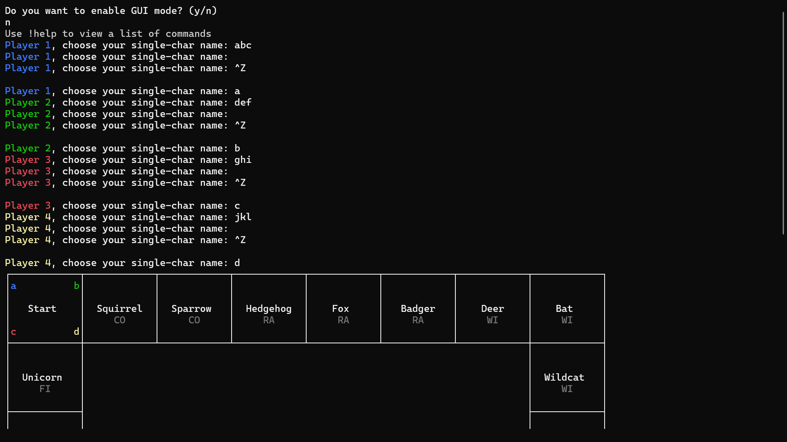 |  |
| 2 | Check that the board renders correctly in CLI mode | <ul><li>Do not select GUI mode</li><li>Input any valid names for the 4 players, e.g. a, b, c, d</li></ul> | Board appears similar to the one shown in the design for the CLI UI. | 2, 3, 4, 5, 7, 10, 11 | 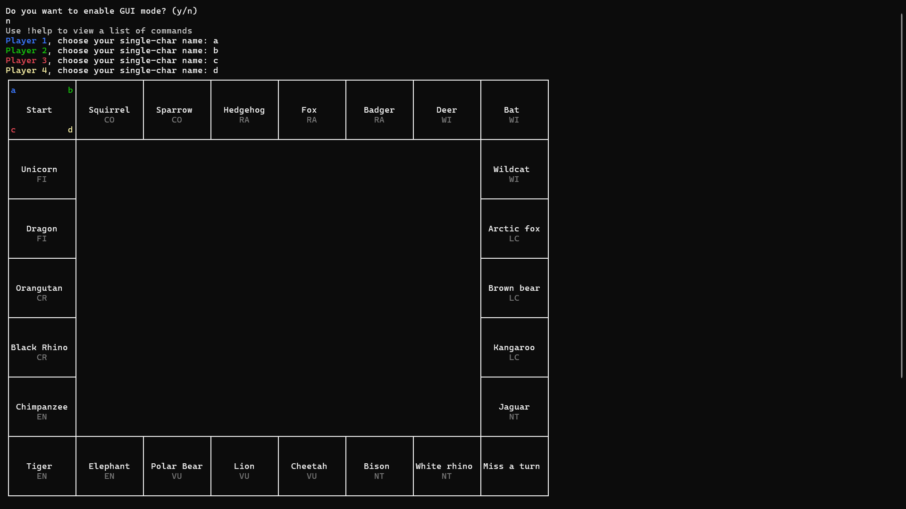 |  |
| 3 | Check that the board renders correctly in GUI mode | <ul><li>Select GUI mode</li><li>Input any valid names for the 4 players, e.g. a, b, c, d</li></ul> | Board appears similar to the one shown in the design for the GUI. | 2, 3, 4, 5, 8, 10 | 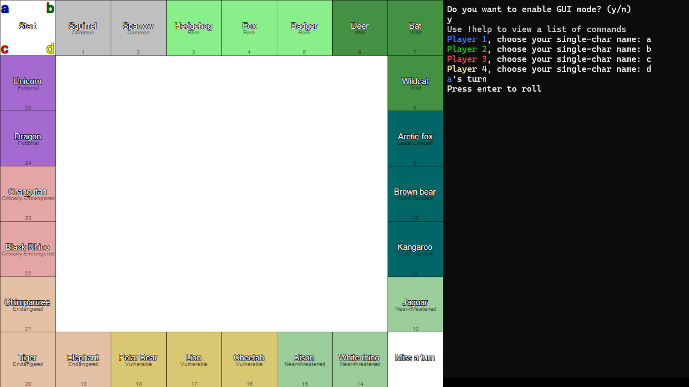 |  |
| 4 | Check that rolling and purchasing animals works correctly in GUI mode | <ul><li>Select GUI mode</li><li>Input any valid names for the 4 players, e.g. a, b, c, d</li><li>Press enter to roll</li><li>Purchase the animal landed on</li></ul> | When enter is pressed, the dice should appear and visibly roll. If the numbers match, the player should be awarded a random card. The player should then be seen taking steps until they reach the animal, at which point they will be shown the animal card, which should look similar to the one in the design section, and asked if they want to purchase it. When they purchase the animal, the colour of its name should update to match the player. | 6, 9, 11, 12, 14, 15 |  |  |
| 5 | Check that rolling and purchasing animals works correctly in CLI mode | <ul><li>Do not select GUI mode</li><li>Input any valid names for the 4 players, e.g. a, b, c, d</li><li>Press enter to roll</li><li>Purchase the animal landed on</li><li>Press enter for the second player to roll</li></ul> | When enter is pressed, the face values on the dice should appear and visibly change. If the numbers match, the player should be awarded a card. The player should then move the correct number of steps to the animal, at which point they will be shown the animal card, which should look similar to the one in the design section, and asked if they want to purchase it. When the next player rolls and the board is displayed again, the colour of the purchased animal's name should have updated to match the player who purchased it | 6, 9, 14, 15 |  |  |
| 6 | Check that upgrading animals works correctly | <ul><li>Either select or do not select GUI mode</li><li>Input any valid names for the 4 players, e.g. a, b, c, d</li><li>Play until a player lands on their own animal</li><li>Choose to upgrade</li><li>Run `!info animal [the id of the animal upgraded]`</li></ul> | When the player lands on their own animal, they should be shown the animal card and asked if they want to upgrade. When they do so, the money should be taken from them. When `!info animal [the id of the animal upgraded]` is run, it should show that the level has increased. | 16 |  | Upgrade occurs at 1:26. |
| 7 | Check that paying other players works correctly | <ul><li>Either select or do not select GUI mode</li><li>Input any valid names for the 4 players, e.g. a, b, c, d</li><li>Play until a player lands on another's animal</li></ul> | When the player lands on another's animal, they should be shown the animal card and informed they have to pay. The correct amount of money should be taken from them and given to the animal's owner. | 17 |  |  |
| 8 | Check that money is correctly awarded when passing Start | <ul><li>Either select or do not select GUI mode</li><li>Input any valid names for the 4 players, e.g. a, b, c, d</li><li>Play until a player passes Start</li><li>Run `!info player [the id of the player who passed Start] m`</li></ul> | When the player passes but does not land on start, they should be awarded £500 before taking the actions required when landing on their destination square. The output of `!info` should show this has occurred. | 18 |  | Start passed at 0:58 |
| 9 | Check that money is correctly awarded when landing on Start | <ul><li>Either select or do not select GUI mode</li><li>Input any valid names for the 4 players, e.g. a, b, c, d</li><li>Play until a player lands on Start</li><li>Run `!info player [the id of the player who passed Start] m`</li></ul> | When the player lands on start, they should be awarded £1000. The output of `!info` should show this. | 19 |  | Start landed on at 1:37. The player number printed when `!info player` was run is incorrect; this was a bug and has been fixed |
| 10 | Check that Miss A Go works correctly | <ul><li>Either select or do not select GUI mode</li><li>Input any valid names for the 4 players, e.g. a, b, c, d</li><li>Play until a player lands on Miss A Go</li><li>Run `!info player [the id of the player who landed on Miss A Go] s`</li><li>Continue play until it would be that player's turn again</li><li>Run `!info player [the id of the player who landed on Miss A Go] s`</li><li>Continue play until the player's next turn</li></ul> | When the player lands on Miss A Go, they should be informed they will miss their next turn. The first `!info` will confirm that this has been updated. When it reaches their turn again, they will instead be told it has been skipped. The second `!info` will show that the skip has been cleared, and when it is the player's turn again, they will take their turn as normal. | 20 |  | Miss a turn landed on at 1:29. |
| 11 | Check that commands work correctly | <ul><li>Either select or do not select GUI mode</li><li>Input any valid names for the 4 players, e.g. a, b, c, d</li><li>Run the following commands:</li><li>`!help`</li><li>`!cheats on`</li><li>`!money set 1 10000`</li><li>`!info player 1`</li><li>`!info animal 3`</li><li>Roll the dice and purchase the animal landed on</li><li>`!trade 1 3 -100 [the id of the animal landed on] `</li><li>`!info player 3 p m`</li><li>`!save "Commands test"`</li><li>`!save "Invalid/name:"`</li><li>`!graph "Commands test" 5000 1000`</li><li>Open the graph</li><li>Restart the program</li><li>`!load "Commands test"`</li><li>`!info player 3 p m`</li></ul> | When `!help` is run, the list of commands and how to use them should be shown. When `!info player 1` is run, some useful information about player 1 should be shown. When `!info animal 3` is run, animal 3's card should be shown. When `!info player 3 p m` is run, it should show that player 3 has lost £100 and gained the animal player 1 had landed on. When `!save "Invalid/name:"` is run, the filepath should be updated and the user should be informed what it was renamed to. When `!graph "Commands test" 5000 1000` is run, a graph similar to the one in Design should be generated and saved in the same folder as the save file, with a resolution of 5000px x 1000px. When `!info player 3 p m` is run after the restart and load, it should output the same information as before the load. | 21, 22, 23, 24, 25, 26, 27, 34, 35, 36, 43 |  | The testing ended prematurely as `!load` caused a crash, as loading has not yet been successfully implemented, meaning objective 34 failed. The program did, however, successfully write the data. During the testing, a parameter was unintentionally left out from the `!money` command, which shows how the program handled the error and informed the user. |
| 12 | Check that AIs work correctly | <ul><li>Either select or do not select GUI mode</li><li>Input any valid names for the 4 players, e.g. a, b, c, d</li><li>Run the following commands:</li><li>`!help ai`</li><li>`!ai 1 1`</li><li>`!ai 2 2`</li><li>`!ai 3 3`</li><li>`!ai 4 4`</li><li>Press enter to roll</li></ul> | When `!help ai` is run, the info for `!ai` should be displayed, which will show what number corresponds to each AI level. These correspond with the AI described in objectives 30, 31, 32, and 33 respectively. When enter is pressed, the AIs should begin playing automatically, behaving according to their AI level. | 28, 29, 30, 31, 32, 33 |  | Player 4 did not behave correctly, as its AI has not been implemented, meaning objective 33 was failed. The graph is visible at 1:56. |
| 13 | Check that the ending of the game works correctly | <ul><li>Either select or do not select GUI mode</li><li>Input any valid names for the 4 players, e.g. a, b, c, d</li><li>To reduce testing time, run `!anims off`</li><li>Play until a player goes 'into debt'</li><li>Play until a player goes bankrupt</li><li>Run `!info player [the id of the player that has gone bankrupt] p m`</li><li>Play until the game ends</li><li>Open the generated graph</li></ul> | When the player goes into debt, they should be informed. When the player goes bankrupt, the colours of the animals previously owned by them should revert to white, to show they are now unowned. When the `!info player` is run, it should show the bankrupted player no longer has any animals and that their money is negative. The generated graph should be similar to the one shown in design. | 37, 38, 39, 40, 41, 42, 44, 45, 46, 47 |  | The command used to reduce testing time disables all 'animations', e.g. pieces visually moving and dice visually rolling. Player is informed they are 'in debt' at 1:31. Player goes bankrupt at 1:52. The game ends at 3:38. Note that, even after b is eliminated, c has another turn; this is to ensure all players have had the same number of turns - if c had gone bankrupt on that final turn, whichever of the two had the most money (least 'debt') when they were bankrupt would win. Graph shown at 3:59. |

Objective 13 cannot easily be tested through regular gameplay, so instead [Testing.Thirteen()](#Testingcs) can be called, returning True if the observed results for rolling 10 million times are a sufficient approximation of the expected results; in testing, it has always returned true, although it is theoretically possible, due to the random nature of Roll, that it would return false

## <u>**Evaluation**</u>

Overall, I feel that the project was a success; in both the recorded testing in the previous section and in test games, every objective was met except objectives 33 and 34, which were to have an Expert AI which predicts future game states and to successfully load the game respectively.

The primary future improvements would be to accomplish these two objectives, as well as to act on the following feedback I recieved on the final version:

- It would be better if, in the GUI version, cards appeared in the GUI rather than in the console
- It would be better if there was a pause between each players turn, as currently it can be hard to keep up
- It would be better if there was a greater variety of cards, perhaps with them being held in a 'deck' to prevent repeats until the deck is exhausted
- There could be a distinction between a player's 'name', a string that could be written in console output, and their 'piece', a char which would be shown on the board
- It's currently impossible to determine the level of an animal without viewing its card; it could be shown as an icon on the UI
- Players often lose track of how much money they have; this could be shown in the center of the board
- In the current form, the GUI board is mostly white; some suggested ways to reduce this include colouring the non-animal tiles, putting a logo in the center of the board, and having a 'stack of cards' in the center of the board, as well as showing the players' money as previously mentioned
- Adding sound effects, e.g. when pieces move
- Currently a player's turn can go by with them taking no action except rolling; this could be alleviated by requiring input to pay another player
- Colouring money changes based on whether they are increases or decreases

## <u>**Appendix**</u>

### AI.cs

### CardClass.cs

### CommandLineInterface.cs

### Commands.cs

### Graphing.cs

### NetProcessing.cs

### PlayerClass.cs

### Program.cs

### Saving.cs

### TileClasses.cs

### Writing.cs

### Testing.cs
